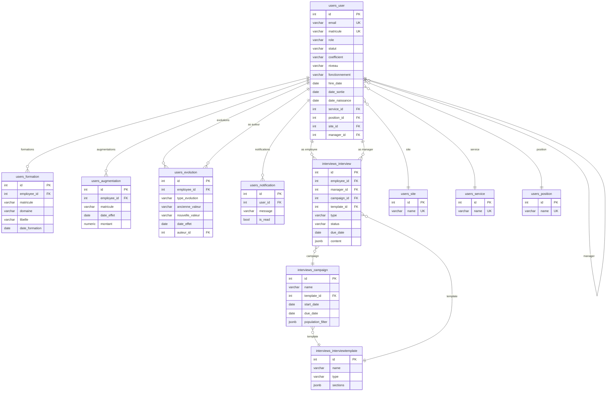

# Schéma de la base de données

PostgreSQL 16 — Base `isbrh` (ou `isbrh_recette` / `isbrh_prod` selon l'environnement).

---

## Tables

### `users_user`
Utilisateurs / collaborateurs. Table principale héritée de `AbstractUser` Django.

| Colonne | Type | Contraintes | Description |
|---|---|---|---|
| `id` | `serial` | PK | |
| `password` | `varchar(128)` | NOT NULL | Hash du mot de passe |
| `last_login` | `timestamptz` | nullable | Dernière connexion |
| `is_superuser` | `bool` | NOT NULL | Superutilisateur Django |
| `is_staff` | `bool` | NOT NULL | Accès admin Django |
| `is_active` | `bool` | NOT NULL | Compte actif |
| `date_joined` | `timestamptz` | NOT NULL | Date de création du compte |
| `username` | `varchar(150)` | UNIQUE NOT NULL | Hérité d'AbstractUser (auto-assigné = email) |
| `email` | `varchar(254)` | UNIQUE | Email professionnel (USERNAME_FIELD) ; optionnel, un email temporaire `{matricule}@sansemail.isb.fr` est généré si absent |
| `first_name` | `varchar(150)` | | Prénom |
| `last_name` | `varchar(150)` | | Nom |
| `role` | `varchar(20)` | NOT NULL default `employee` | `admin` / `rh` / `manager` / `employee` / `stagiaire` / `alternant` |
| `sexe` | `varchar(20)` | | `homme` / `femme` / `non_binaire` |
| `date_naissance` | `date` | nullable | Date de naissance |
| `telephone` | `varchar(50)` | | Téléphone |
| `photo` | `varchar(100)` | nullable | Chemin photo de profil |
| `icon` | `varchar(10)` | default `''` | Émoji (remplace la photo) |
| `preferences` | `text` | default `''` | JSON (thème couleur, etc.) |
| `matricule` | `varchar(50)` | UNIQUE NOT NULL | Matricule obligatoire |
| `hire_date` | `date` | nullable | Date d'entrée |
| `date_sortie` | `date` | nullable | Date de sortie |
| `type_contrat` | `varchar(20)` | | `cdi` / `cdd` / `interim` / `alternance` / `stage` |
| `statut` | `varchar(20)` | NOT NULL default `actif` | `actif` / `inactif` / `sortie` |
| `coefficient` | `varchar(20)` | | Coefficient |
| `niveau` | `varchar(50)` | | Niveau du poste |
| `fonctionnement` | `varchar(50)` | | Mode de fonctionnement |
| `salaire_brut` | `numeric(10,2)` | nullable | Salaire brut |
| `forfait_jour` | `bool` | NOT NULL default `false` | Forfait jour |
| `tickets_restaurant` | `bool` | NOT NULL default `false` | Tickets restaurant |
| `cadre` | `bool` | NOT NULL default `false` | Statut cadre |
| `service_id` | `int4` | FK → `users_service.id` | Service |
| `position_id` | `int4` | FK → `users_position.id` | Poste |
| `site_id` | `int4` | FK → `users_site.id` | Site |
| `manager_id` | `int4` | FK → `users_user.id` | N+1 hiérarchique |
| `agence_interim` | `varchar(100)` | | Agence d'intérim |
| `onboarding_status` | `varchar(20)` | NOT NULL default `pending` | Obsolète |
| `groups` | M2M | via `auth_user_groups` | Groupes Django |
| `user_permissions` | M2M | via `auth_user_permissions` | Permissions Django |

**Index :** `email` (unique), `matricule` (unique), `manager_id`, `service_id`, `position_id`, `site_id`

---

### `users_site`
Sites / établissements.

| Colonne | Type | Contraintes | Description |
|---|---|---|---|
| `id` | `serial` | PK | |
| `name` | `varchar(100)` | UNIQUE NOT NULL | Nom du site |

---

### `users_service`
Services / départements.

| Colonne | Type | Contraintes | Description |
|---|---|---|---|
| `id` | `serial` | PK | |
| `name` | `varchar(100)` | UNIQUE NOT NULL | Nom du service |

---

### `users_position`
Postes / fonctions.

| Colonne | Type | Contraintes | Description |
|---|---|---|---|
| `id` | `serial` | PK | |
| `name` | `varchar(100)` | UNIQUE NOT NULL | Intitulé du poste |

---

### `users_formation`
Formations suivies par les collaborateurs.

| Colonne | Type | Contraintes | Description |
|---|---|---|---|
| `id` | `serial` | PK | |
| `employee_id` | `int4` | FK → `users_user.id` NOT NULL | Collaborateur |
| `matricule` | `varchar(50)` | | Matricule (redondant) |
| `domaine` | `varchar(255)` | | Domaine de formation |
| `libelle` | `varchar(255)` | | Intitulé de la formation |
| `date_formation` | `date` | nullable | Date de la formation |
| `nature` | `varchar(50)` | | Nature (interne, externe, CPF…) |
| `created_at` | `timestamptz` | NOT NULL | Date d'import |

**Index :** `employee_id`

---

### `users_augmentation`
Augmentations salariales.

| Colonne | Type | Contraintes | Description |
|---|---|---|---|
| `id` | `serial` | PK | |
| `employee_id` | `int4` | FK → `users_user.id` NOT NULL | Collaborateur |
| `matricule` | `varchar(50)` | | Matricule (redondant) |
| `date_effet` | `date` | nullable | Date d'effet |
| `montant` | `numeric(10,2)` | nullable | Montant de l'augmentation |
| `created_at` | `timestamptz` | NOT NULL | Date d'import |

**Index :** `employee_id`

---

### `users_evolution`
Historique des évolutions de carrière d'un collaborateur (poste, service, site, statut, niveau, coefficient, salaire). Une ligne = un changement daté, alimenté par l'import évolutions ou le suivi automatique des modifications de `users_user`.

| Colonne | Type | Contraintes | Description |
|---|---|---|---|
| `id` | `serial` | PK | |
| `employee_id` | `int4` | FK → `users_user.id` NOT NULL (PROTECT) | Collaborateur concerné |
| `type_evolution` | `varchar(20)` | NOT NULL | `poste` / `service` / `site` / `statut` / `niveau` / `coefficient` / `salaire` |
| `ancienne_valeur` | `varchar(255)` | | Valeur avant l'évolution |
| `nouvelle_valeur` | `varchar(255)` | | Valeur après l'évolution |
| `date_effet` | `date` | nullable | Date de prise d'effet |
| `auteur_id` | `int4` | FK → `users_user.id` nullable (SET_NULL) | Auteur de la modification (vide si créé par import) |
| `created_at` | `timestamptz` | NOT NULL | Date de création de l'enregistrement |

**Index :** `employee_id`, `auteur_id`
**Tri par défaut :** `-date_effet`, `-created_at`

---

### `users_notification`
Notifications pour les managers.

| Colonne | Type | Contraintes | Description |
|---|---|---|---|
| `id` | `serial` | PK | |
| `user_id` | `int4` | FK → `users_user.id` NOT NULL | Destinataire |
| `message` | `varchar(255)` | NOT NULL | Texte de la notification |
| `link` | `varchar(255)` | | Lien frontend |
| `is_read` | `bool` | NOT NULL default `false` | Lecture |
| `created_at` | `timestamptz` | NOT NULL | Date de création |

**Index :** `user_id`

---

### `interviews_campaign`
Campagnes d'entretiens.

| Colonne | Type | Contraintes | Description |
|---|---|---|---|
| `id` | `serial` | PK | |
| `name` | `varchar(200)` | NOT NULL | Nom de la campagne |
| `template_id` | `int4` | FK → `interviews_interviewtemplate.id` nullable | Modèle utilisé |
| `description` | `text` | | Description |
| `start_date` | `date` | NOT NULL | Date de début |
| `due_date` | `date` | NOT NULL | Date d'échéance |
| `population_filter` | `jsonb` | NOT NULL default `{}` | Filtre (site, service, employés) |
| `created_at` | `timestamptz` | NOT NULL | |
| `updated_at` | `timestamptz` | NOT NULL | |

---

### `interviews_interviewtemplate`
Modèles d'entretien.

| Colonne | Type | Contraintes | Description |
|---|---|---|---|
| `id` | `serial` | PK | |
| `name` | `varchar(200)` | NOT NULL | Nom du modèle |
| `type` | `varchar(20)` | NOT NULL | `annual` / `professional` / `bilan` / `forfait` / `fin_carriere` |
| `description` | `text` | | Description |
| `sections` | `jsonb` | NOT NULL default `[]` | Sections et questions (JSON structuré) |
| `created_at` | `timestamptz` | NOT NULL | |
| `updated_at` | `timestamptz` | NOT NULL | |

---

### `interviews_interview`
Entretiens individuels.

| Colonne | Type | Contraintes | Description |
|---|---|---|---|
| `id` | `serial` | PK | |
| `employee_id` | `int4` | FK → `users_user.id` NOT NULL | Collaborateur évalué |
| `manager_id` | `int4` | FK → `users_user.id` NOT NULL | Manager évaluateur |
| `campaign_id` | `int4` | FK → `interviews_campaign.id` nullable | Campagne parente |
| `template_id` | `int4` | FK → `interviews_interviewtemplate.id` nullable | Modèle utilisé |
| `type` | `varchar(20)` | NOT NULL | `annual` / `professional` / `bilan` / `forfait` / `fin_carriere` |
| `status` | `varchar(20)` | NOT NULL default `draft` | `draft` / `in_progress` / `completed` / `signed` / `cancelled` |
| `due_date` | `date` | NOT NULL | Date limite |
| `content` | `jsonb` | NOT NULL default `{}` | Réponses (JSON) |
| `document` | `varchar(100)` | nullable | Fichier uploadé |
| `created_at` | `timestamptz` | NOT NULL | |
| `updated_at` | `timestamptz` | NOT NULL | |

**Index :** `employee_id`, `manager_id`, `campaign_id`, `template_id`

---

### Tables Django standards

| Table | Rôle |
|---|---|
| `auth_group` | Groupes Django |
| `auth_group_permissions` | Permissions des groupes |
| `auth_permission` | Permissions Django |
| `django_admin_log` | Journal d'admin |
| `django_content_type` | Types de contenu |
| `django_migrations` | Migrations appliquées |
| `django_session` | Sessions utilisateur |
| `token_blacklist_blacklistedtoken` | Tokens JWT révoqués |
| `token_blacklist_outstandingtoken` | Tokens JWT émis |

---

## Relations (clés étrangères)

```
users_user
  ├─ service_id ──→ users_service.id
  ├─ position_id ─→ users_position.id
  ├─ site_id ─────→ users_site.id
  └─ manager_id ──→ users_user.id (auto-référence)

users_formation
  └─ employee_id ─→ users_user.id

users_augmentation
  └─ employee_id ─→ users_user.id

users_evolution
  ├─ employee_id ─→ users_user.id
  └─ auteur_id ───→ users_user.id (nullable)

users_notification
  └─ user_id ─────→ users_user.id

interviews_interview
  ├─ employee_id ─→ users_user.id
  ├─ manager_id ──→ users_user.id
  ├─ campaign_id ─→ interviews_campaign.id
  └─ template_id ─→ interviews_interviewtemplate.id

interviews_campaign
  └─ template_id ─→ interviews_interviewtemplate.id
```

## Schéma relationnel (Mermaid)


